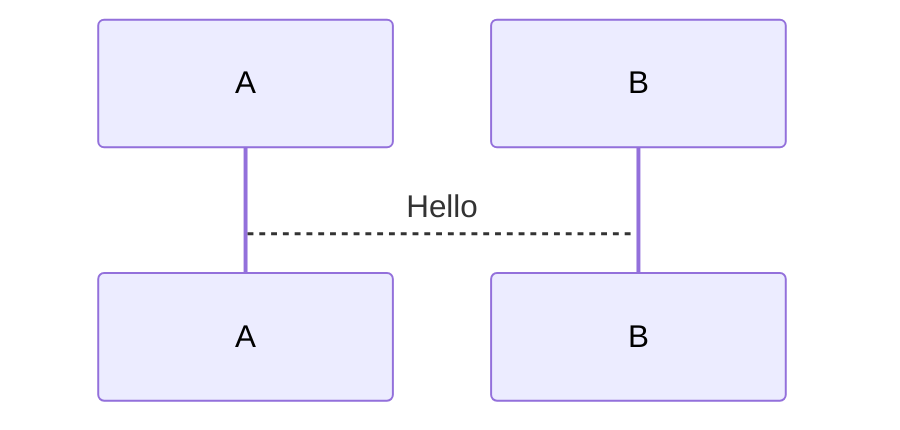

# presenterm Knowledge Base

> Terminal markdown presentation tool. [Docs](https://mfontanini.github.io/presenterm/) | [GitHub](https://github.com/mfontanini/presenterm)

## Quick Reference

### Slide Structure
```markdown
---
title: "Presentation Title"
sub_title: Optional subtitle
author: Name
authors: [Name1, Name2]  # alternative for multiple
theme:
  name: light  # or: terminal-light for projectors
---

Slide Title
===

Content here

<!-- end_slide -->
```

Use `<!-- end_slide -->` to separate slides (not `---`).  
Enable `---` shorthand via config: `end_slide_shorthand: true`

[Docs: Features](https://mfontanini.github.io/presenterm/features/introduction.html)

---

## Comment Commands

All commands use `<!-- command -->` syntax.

| Command | Usage | Description |
|---------|-------|-------------|
| `end_slide` | `<!-- end_slide -->` | End current slide |
| `pause` | `<!-- pause -->` | Reveal content incrementally |
| `jump_to_middle` | `<!-- jump_to_middle -->` | Vertical center (separator slides) |
| `new_line` | `<!-- new_line -->` | Single newline |
| `new_lines` | `<!-- new_lines: N -->` | N newlines |
| `alignment` | `<!-- alignment: center -->` | `left`, `center`, `right` |
| `font_size` | `<!-- font_size: 2 -->` | 1-7, kitty only |
| `incremental_lists` | `<!-- incremental_lists: true -->` | Auto-pause between bullets |
| `list_item_newlines` | `<!-- list_item_newlines: 2 -->` | Spacing between list items |
| `no_footer` | `<!-- no_footer -->` | Hide footer this slide |
| `skip_slide` | `<!-- skip_slide -->` | Exclude from presentation |
| `include` | `<!-- include: file.md -->` | Include external file |
| `speaker_note` | `<!-- speaker_note: text -->` | Speaker notes |
| `snippet_output` | `<!-- snippet_output: id -->` | Place exec output |

List all: `presenterm --list-comment-commands`

[Docs: Commands](https://mfontanini.github.io/presenterm/features/commands.html)

---

## Column Layouts

```markdown
<!-- column_layout: [2, 1] -->

<!-- column: 0 -->
Left content (2/3 width)

<!-- column: 1 -->
Right content (1/3 width)

<!-- reset_layout -->
Full-width content below
```

Centering trick: `<!-- column_layout: [1, 3, 1] -->` then use column 1.

[Docs: Layout](https://mfontanini.github.io/presenterm/features/layout.html)

---

## Code Blocks

### Syntax
````markdown
```rust +line_numbers
fn main() { }
```
````

### Flags
| Flag | Effect |
|------|--------|
| `+line_numbers` | Show line numbers |
| `+exec` | Executable (ctrl+e) |
| `+exec_replace` | Auto-execute, replace block with output |
| `+image` | Treat exec output as image |
| `+render` | Pre-render (mermaid/latex/typst/d2) |
| `+width:50%` | Image width for rendered |
| `+no_background` | Remove code background |
| `+acquire_terminal` | Full TTY for interactive programs |
| `+validate` | Validate only, not executable |
| `+expect:failure` | Expect non-zero exit |
| `+id:name` | Named output for `snippet_output` |

### Selective/Dynamic Highlighting
```markdown
```rust {1,3,5-7}     # highlight specific lines
```rust {1,3|5-7}     # dynamic: 1,3 first, then 5-7
```rust {all|1-3}     # all lines, then 1-3
```

### External Files
````markdown
```file +exec +line_numbers
path: snippet.rs
language: rust
start_line: 5
end_line: 10
```
````

### Hidden Lines (for exec)
- Rust: lines starting with `# ` hidden
- Python/bash/go/etc: lines starting with `/// ` hidden

[Docs: Code Highlighting](https://mfontanini.github.io/presenterm/features/code/highlighting.html) | [Execution](https://mfontanini.github.io/presenterm/features/code/execution.html)

---

## Diagrams & Formulas

### Mermaid
````markdown

````
Requires: `mermaid-cli`

### LaTeX
````markdown
```latex +render
\[ \sum_{n=1}^{\infty} 2^{-n} = 1 \]
```
````
Requires: `typst`, `pandoc`

### Typst
````markdown
```typst +render +width:50%
$f(x) = x + 1$
```
````
Requires: `typst`

### D2
````markdown
```d2 +render
shape: sequence_diagram
A -> B: Hello
```
````
Requires: `d2`

Config PPI: `typst: { ppi: 400 }`

[Docs: Mermaid](https://mfontanini.github.io/presenterm/features/code/mermaid.html) | [LaTeX/Typst](https://mfontanini.github.io/presenterm/features/code/latex.html)

---

## Images

```markdown


```

- Paths relative to presentation file
- Auto-resize to fit terminal
- Supports: kitty, iterm2, wezterm, ghostty, foot
- GIFs animate automatically
- tmux: enable `allow-passthrough`

[Docs: Images](https://mfontanini.github.io/presenterm/features/images.html)

---

## Colored Text

```markdown
<span style="color: #ff0000">red text</span>
<span style="background-color: palette:foo">palette bg</span>
<span class="my_class">themed class</span>
```

Only `<span>` tags supported.

[Docs: Colored Text](https://mfontanini.github.io/presenterm/features/introduction.html#colored-text)

---

## Speaker Notes

```markdown
<!-- speaker_note: Remember to mention X -->
```

Run: 
```bash
presenterm -P slides.md  # main (publish)
presenterm -l            # listener (notes view)
```

Config: `speaker_notes: { always_publish: true }`

[Docs: Speaker Notes](https://mfontanini.github.io/presenterm/features/speaker-notes.html)

---

## Themes

### Built-in (light themes for projectors)
- `light` — light theme
- `terminal-light` — inherits terminal colors (light)
- `catppuccin-latte` — light catppuccin

### Front Matter
```yaml
---
theme:
  name: light
  # or path:
  path: /path/to/theme.yaml
  # or override:
  override:
    default:
      colors:
        foreground: "000000"
        background: "ffffff"
---
```

Preview all: `presenterm --list-themes`

Custom themes: `~/.config/presenterm/themes/*.yaml`

[Docs: Themes](https://mfontanini.github.io/presenterm/features/themes/introduction.html) | [Definition](https://mfontanini.github.io/presenterm/features/themes/definition.html)

---

## CLI Reference

| Flag | Description |
|------|-------------|
| `-p`, `--present` | Presentation mode (no hot reload) |
| `-t`, `--theme NAME` | Use theme |
| `-x` | Enable code execution |
| `-X` | Enable exec_replace |
| `-e`, `--export-pdf` | Export PDF (requires weasyprint) |
| `-E`, `--export-html` | Export HTML |
| `-o`, `--output PATH` | Export output path |
| `-P`, `--publish-speaker-notes` | Publish notes |
| `-l`, `--listen-speaker-notes` | Listen for notes |
| `--validate-overflows` | Check slides fit terminal |
| `--validate-snippets` | Validate executable code |
| `--list-themes` | Preview themes |
| `--list-comment-commands` | List all commands |
| `--image-protocol PROTO` | Force image protocol |

[Docs: Settings](https://mfontanini.github.io/presenterm/configuration/settings.html)

---

## Navigation (In Presentation)

| Key | Action |
|-----|--------|
| `→`, `l`, `j`, `Space` | Next |
| `←`, `h`, `k`, `Backspace` | Previous |
| `gg` | First slide |
| `G` | Last slide |
| `NG` | Go to slide N |
| `Ctrl+p` | Slide index modal |
| `?` | Keybindings help |
| `Ctrl+e` | Execute code block |
| `Ctrl+c` | Exit |

---

## Config File

Location: `~/.config/presenterm/config.yaml`

```yaml
defaults:
  theme: light
  max_columns: 100
  image_protocol: auto

snippet:
  exec:
    enable: true

speaker_notes:
  always_publish: true

typst:
  ppi: 400

mermaid:
  scale: 2
  theme: neutral
  background: transparent
```

[Docs: Configuration](https://mfontanini.github.io/presenterm/configuration/settings.html)

---

## Tech Talk Template

```markdown
---
title: "Talk Title"
author: Your Name
theme:
  name: light
---

Agenda
===

<!-- incremental_lists: true -->

- Point 1
- Point 2
- Point 3

<!-- end_slide -->

<!-- jump_to_middle -->

Section Title
===

<!-- end_slide -->

Code Demo
===

<!-- column_layout: [1, 1] -->

<!-- column: 0 -->

```rust +exec +line_numbers {1-3|5-7}
fn main() {
    println!("Hello");
}

fn demo() {
    // more code
}
```

<!-- column: 1 -->

Key points:
- Point A
- Point B

<!-- end_slide -->
```

---

## Doc Links

| Topic | URL |
|-------|-----|
| Introduction | https://mfontanini.github.io/presenterm/features/introduction.html |
| Commands | https://mfontanini.github.io/presenterm/features/commands.html |
| Layout | https://mfontanini.github.io/presenterm/features/layout.html |
| Code | https://mfontanini.github.io/presenterm/features/code/highlighting.html |
| Execution | https://mfontanini.github.io/presenterm/features/code/execution.html |
| Mermaid | https://mfontanini.github.io/presenterm/features/code/mermaid.html |
| LaTeX/Typst | https://mfontanini.github.io/presenterm/features/code/latex.html |
| Images | https://mfontanini.github.io/presenterm/features/images.html |
| Speaker Notes | https://mfontanini.github.io/presenterm/features/speaker-notes.html |
| Themes Intro | https://mfontanini.github.io/presenterm/features/themes/introduction.html |
| Theme Definition | https://mfontanini.github.io/presenterm/features/themes/definition.html |
| Exports | https://mfontanini.github.io/presenterm/features/exports.html |
| Settings | https://mfontanini.github.io/presenterm/configuration/settings.html |
| Examples | https://github.com/mfontanini/presenterm/tree/master/examples |
