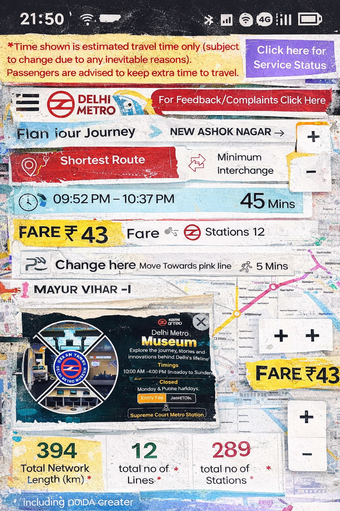
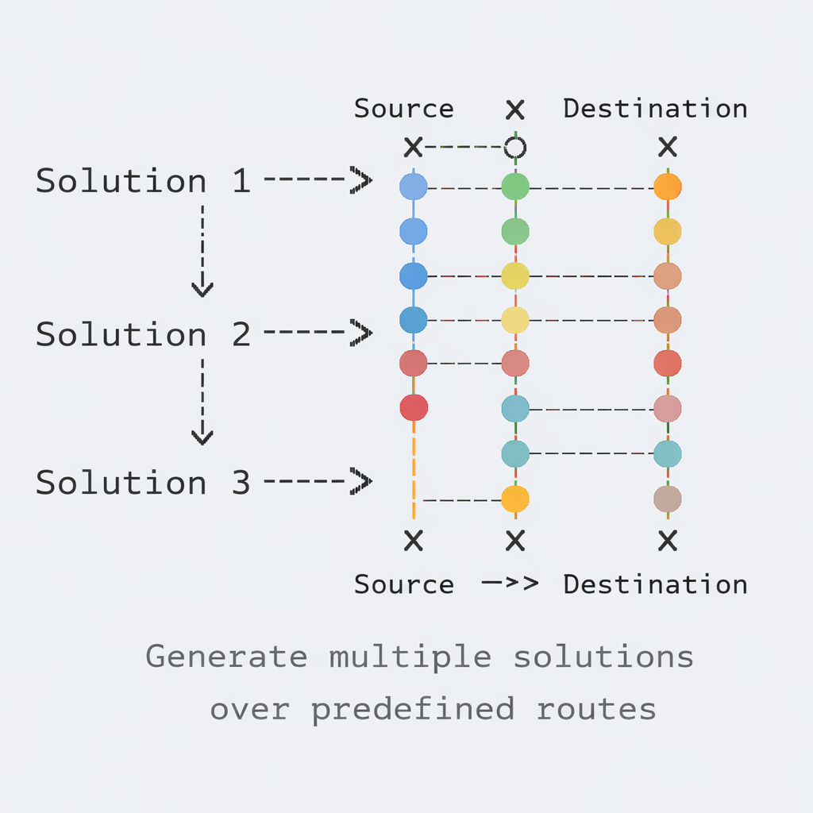
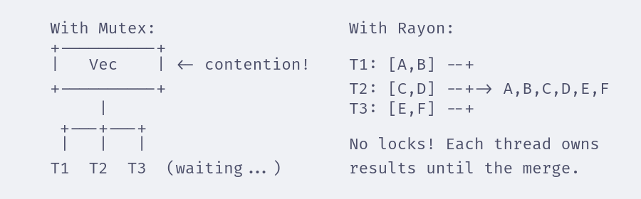
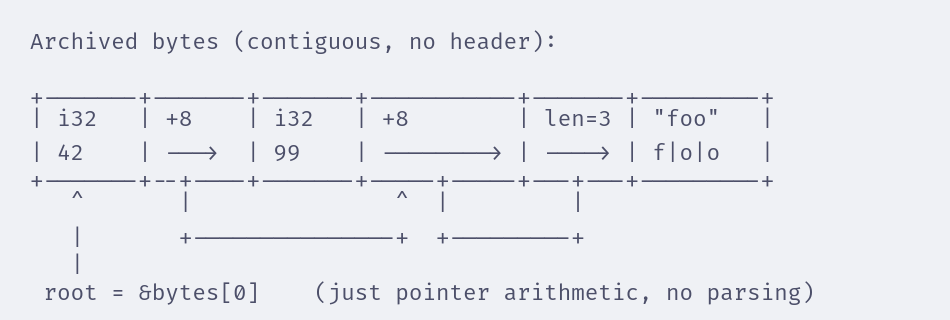

---
theme:
  name: catppuccin-latte
---

<!-- font_size: 3 -->
<!-- alignment: center -->

<!-- jump_to_middle -->

# Oxydizing our beloved metro

<!-- font_size: 2 -->

<!-- column_layout: [2, 4, 1] -->

<!-- column: 1 -->

<!-- alignment: left -->

Tushar Saxena [keogami]
https://github.com/keogami
https://linkedin.com/in/keogami--

<!-- reset_layout -->

<!-- end_slide -->

My Qualms
---

<!-- font_size: 2 -->

<!-- speaker_note: Show the state of the DMRC app - bland UI, political branding, missing features -->

<!-- column_layout: [1, 1] -->

<!-- column: 0 -->



<!-- column: 1 -->

- Bland UI, political branding
- No fuzzy search (I can't spell Chattarpur)
- Funky map interface (No pinch zoom, really?)
- No offline support (Can't plan when in tunnels)
- No dark theme
- Nit: what's `80mins`? just say `1hour 20mins`

<!-- reset_layout -->

<!-- end_slide -->

Missing Features
===

<!-- speaker_note: What power users actually want -->

<!-- font_size: 2 -->


<!-- column_layout: [1, 3, 1] -->

<!-- column: 1 -->

- Location-to-location journey planning
- Crowd indicators
- Multi-point trip planning

<!-- reset_layout -->

<!-- end_slide -->

The Challenge
===

<!-- speaker_note: Why we can't just "fix" the official app -->

<!-- font_size: 2 -->


- Government website - very hard to lobby
- Complex groundwork needed
- Too much for a single person

<!-- end_slide -->

<!-- jump_to_middle -->

The Plan
===

<!-- end_slide -->

The Plan
===

<!-- speaker_note: Introduce the Rust crate approach -->

<!-- font_size: 2 -->


<!-- column_layout: [1, 3, 1] -->

<!-- column: 1 -->

- Create a Rust crate for DMRC
- Solve routing
- Make it **fast**
- Make it cross-platform (including web)

<!-- reset_layout -->

<!-- end_slide -->

Goals
===

<!-- speaker_note: Technical objectives we're aiming for -->

<!-- font_size: 2 -->


<!-- column_layout: [1, 3, 1] -->

<!-- column: 1 -->

- Pre-compute all journeys for the entire network
- Embed all data into the binary itself
  - Enables location-to-location planning
  - Minimize runtime cost
- Compatible with `wasm32-*` targets
- Bells and whistles: fuzzy search, humantime

<!-- reset_layout -->

<!-- end_slide -->

<!-- jump_to_middle -->

RAPTOR
===

<!-- end_slide -->

RAPTOR Algorithm
===

<!-- speaker_note: Short intro to the algorithm, reference raptor-rs -->

<!-- column_layout: [1, 2] -->

<!-- column: 0 -->



<!-- column: 1 -->

<!-- font_size: 2 -->

**R**ound-b**A**sed **P**ublic **T**ransit **O**ptimized **R**outer

<!-- font_size: 1 -->

Efficiently finds optimal routes through public transit networks. Developed by Microsoft.

<!-- pause -->

<!-- font_size: 2 -->

## Why?


- Finds a set of pareto-optimal journeys
- Can be extended for multiple criterias, say, "Min Transfer _and_ Min Crowd"
- Can be multi-core
- Can merge multiple networks, say `Rapido`, `NMRC`, etc
- Can be real-time, taking delays into account
- Simple to use with google's GTFS format

<!-- reset_layout -->

<!-- end_slide -->

The Data Structure
===

<!-- speaker_note: Decide on data structure for journeys -->

<!-- font_size: 2 -->

```rust +line_numbers {1-2|4-9|11-14}
type StopId = u16; // impls: Ord, Copy
type RouteId = u8; // vs. &str or String

struct Journey {
    // better than storing all stops.
    // transfers are implicit
    plan: Vec<(RouteId, StopId)>,
    arrival: u16
}

struct Journeys {
    plans: BTreeMap<(StopId, StopId), Vec<Journey>>,
    aux_data: // lookup tables and all
}
```

<!-- end_slide -->

Now we compute the entire network
===

<!-- speaker_note: Run it for every combination, hit the 25min wall -->

<!-- font_size: 2 -->

```rust +line_numbers
let timetable = GtfsTimetable::new(&dmrc_gtfs_data);
let plans: BTreeMap<_, _> = every_possible_pair
    .iter()
    .map(|(source, dest)| {
        timetable.raptor(MAX_TRANSFERS, source, dest)
    })
    .collect();
```

<!-- new_lines: 4 -->

<!-- pause -->

<!-- alignment: center -->

<!-- font_size: 4 -->
Runtime: **~25 minutes**

<!-- end_slide -->

Use threads (Can't use tokio. why?)
===

<!-- speaker_note: Show threading with OS threads, explain lock contention problem -->

<!-- font_size: 2 -->

```rust +line_numbers {1|2|3-6}
let timetable = Arc::new(GtfsTimetable::new(&dmrc_gtfs_data));
let plans: Arc<Mutex<BTreeMap<_, _>>> = Default::default();
for (source, dest) in every_possible_pair {
    // spawn thread, compute, get lock,
    // push join handle, yada yada
}
```

<!-- new_line -->

**Problems:**

- Threads fight for the lock
- Different mental model
- Oddly complicated

<!-- end_slide -->

<!-- jump_to_middle -->

Enter Rayon
===

<!-- end_slide -->

Rayon
===

<!-- speaker_note: Explain the crate and how it avoids lock contention -->

<!-- font_size: 2 -->

A data parallelism library for Rust

- Work-stealing thread pool
- You already know the 
- Results collected **without locks**
- Just change `.iter()` to `.par_iter()`
- Also! Finally a real world use for linked lists lol



<!-- end_slide -->

The Transformation
===

<!-- speaker_note: Tease .par_iter() with 3min runtime -->

<!-- font_size: 2 -->

```diff +line_numbers
 let plans: BTreeMap<_, _> = every_possible_pair
-    .iter()
+    .par_iter()
     .map(|(source, dest)| {
         timetable.raptor(MAX_TRANSFERS, source, dest)
     })
     .collect();
```

<!-- new_lines: 4 -->

<!-- pause -->

<!-- alignment: center -->

<!-- font_size: 4 -->
Runtime: **~3 minutes**

<!-- reset_layout -->

<!-- end_slide -->

<!-- jump_to_middle -->

Embedding the Data
===

<!-- end_slide -->

Build-time Computation
===

<!-- speaker_note: Introduce build.rs and include_bytes! macro -->

<!-- font_size: 2 -->

```rust +line_numbers
// build.rs
fn main() {
    let journeys = compute_all_journeys();
    let bytes = serialize(&journeys);

    std::fs::write("journeys.bin", bytes).unwrap();
}
```

<!-- pause -->

```rust +line_numbers
// lib.rs
static JOURNEYS: &[u8] = include_bytes!("journeys.bin");

fn load_journeys() -> Journeys {
    let journeys: Journeys = deserialize(JOURNEYS);
    // use journeys...
}
```

<!-- end_slide -->

The Problem
===

<!-- speaker_note: Think about serialization and program startup implications -->

<!-- font_size: 2 -->

- Data lives in the ELF `.data` section, but
- But we still need to **deserialize** at startup
- Parsing takes time
- Memory gets allocated twice
- We can't just dump our memory to the file and read back. why?

<!-- pause -->

**What if we could skip deserialization entirely?**

<!-- end_slide -->

<!-- jump_to_middle -->

Enter rkyv
===

<!-- end_slide -->

rkyv
===

<!-- speaker_note: Explain how it achieves zero-parsing and zero-copy deserialization -->

<!-- font_size: 2 -->

<!-- column_layout: [1, 5, 1] -->

<!-- column: 1 -->

Rust Archive - Full Zero-copy deserialization

- Archived format **is** the in-memory format
- No parsing, no allocation
- Just cast the bytes and use them
- Cross-platform compatible
- Supports all standard DS: BTreeMap, HashMap, Vec, even shared refs like Rc and Arc

<!-- reset_layout -->

<!-- end_slide -->

How It Works
===

<!-- speaker_note: Tease the blog entry for the construction -->

<!-- font_size: 2 -->

<!-- column_layout: [1, 1] -->

<!-- column: 0 -->



<!-- column: 1 -->

- Converts all `&T` to `RelPtr<T>`
- Forces all data to be strictly page-aligned
- Usage is as simple as adding a derive macro
- Can even perform validity checks with `bytechecks`

<!-- reset_layout -->

<!-- new_lines: 3 -->
<!-- alignment: center -->

No parsing. No allocation. Just pointer arithmetic.


<!-- end_slide -->

Using rkyv
===

<!-- font_size: 2 -->

```rust +line_numbers {1-6|8-14}
use rkyv::{Archive, Serialize};

#[derive(Archive, Serialize)]
struct Journeys {
    plans: BTreeMap<(StopId, StopId), Vec<Journey>>,
    // ...snipped...
}

// embed into .data section
static BYTES: &[u8] = include_bytes!("journeys.rkyv");

// SAFETY: the bytes are in our binary itself, we can trust it
let archived = unsafe { rkyv::access_unchecked::<ArchivedJourneys>(BYTES) };
// Use archived.plans directly - no deserialization!
```

<!-- end_slide -->

<!-- jump_to_middle -->

dmrc-rs
===

<!-- end_slide -->

The Result
===

<!-- speaker_note: Run an example program -->

<!-- font_size: 2 -->

```rust +line_numbers
use dmrc::load_journeys();

fn main() {
    let journeys = load_journeys();  // instant!

    // fuzzy search powered by: Nucleo
    let ps = journeys.fuzzy_search("Rajiv Chow").first();
    let pt = journeys.fuzzy_search("Chattarpur").first();

    let journey = journeys.plans.get((ps, pt)).first();

    println!("{:?}", journey);
}
```

<!-- end_slide -->

WebAssembly
===

<!-- speaker_note: Emphasize that it's just memory access, flex rkyv's cross-platform compatibility -->

<!-- font_size: 2 -->

- Remember our goal: `wasm32-*` targets
- rkyv works across platforms
- It's just memory access!

<!-- pause -->

```bash
cargo build --target wasm32-unknown-unknown
```

<!-- end_slide -->

Running with Wasmer
===

<!-- speaker_note: Run the same example with wasmer -->

<!-- font_size: 2 -->

```bash +line_numbers
# Compile to WASM
cargo build --example interactive --target wasm32-wasip1 --release

# Run with wasmer
wasmer run target/wasm32-wasi/release/interactive.wasm
```

<!-- end_slide -->

<!-- font_size: 2 -->

Running with Wasmer (cont.)
===

```
Enter source stop: rajiv chow

Matches:
  [1] Rajiv Chowk

Select [1-1]: 1

Enter target stop: chattpur

Matches:
  [1] Chhattarpur

Select [1-1]: 1

Journey from Rajiv Chowk to Chhattarpur:
  Arrival: 37m 23s seconds

  Route:
    [YELLOW_Samaypur Badli to Huda City Centre] Rajiv Chowk
```

<!-- end_slide -->

<!-- jump_to_middle -->

Conclusion
===

<!-- end_slide -->

What We Built
===

<!-- speaker_note: Proof of concept works, but API not ergonomic yet -->

<!-- font_size: 2 -->

- Pre-computed routing for Delhi Metro
- Fast startup with zero-copy deserialization
- Cross-platform including WASM
- Proof of concept **works**

**But...**

- API is not ergonomic yet
- Open for contributions soon!

<!-- end_slide -->

Fin.
===

<!-- font_size: 2 -->

<!-- speaker_note: Link to linkedin and blog -->

<!-- new_lines: 5 -->

<!-- column_layout: [1, 1] -->

<!-- column: 0 -->

**Tushar Saxena [keogami]**

Questions?

https://linkedin.com/in/keogami--

https://github.com/keogami

https://crates.io/crates/raptor

https://crates.io/crates/dmrc-rs

<!-- column: 1 -->


<!-- reset_layout -->
