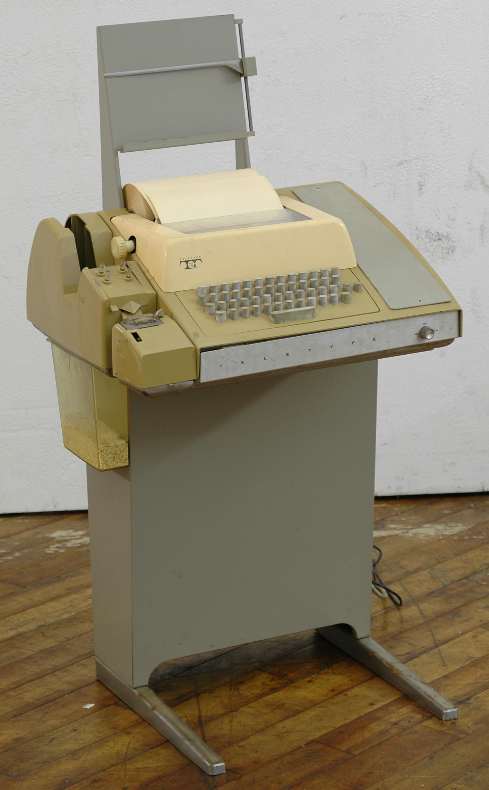
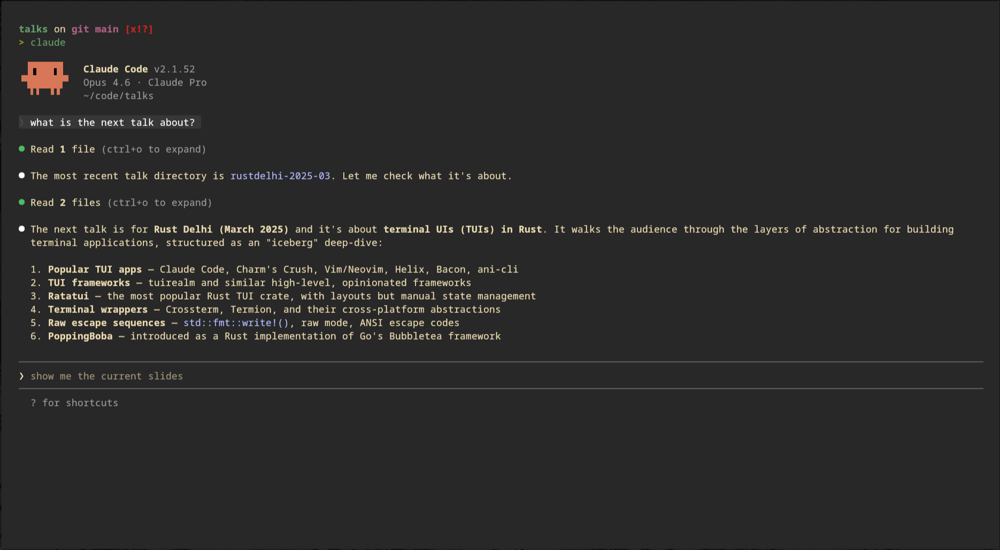
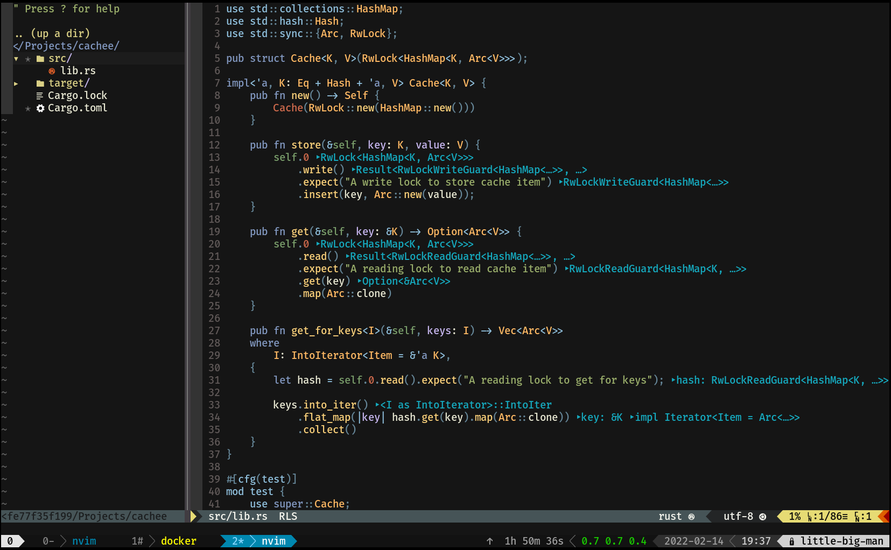
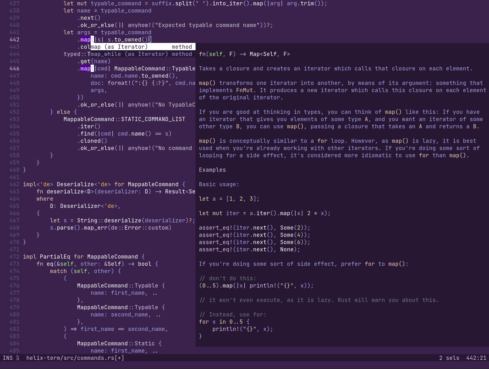
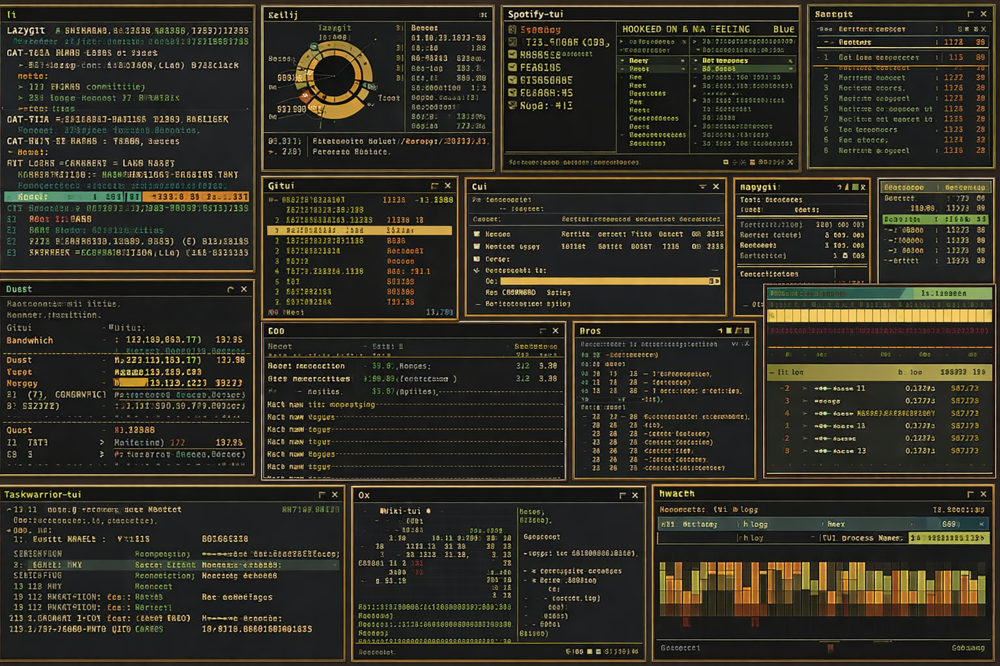
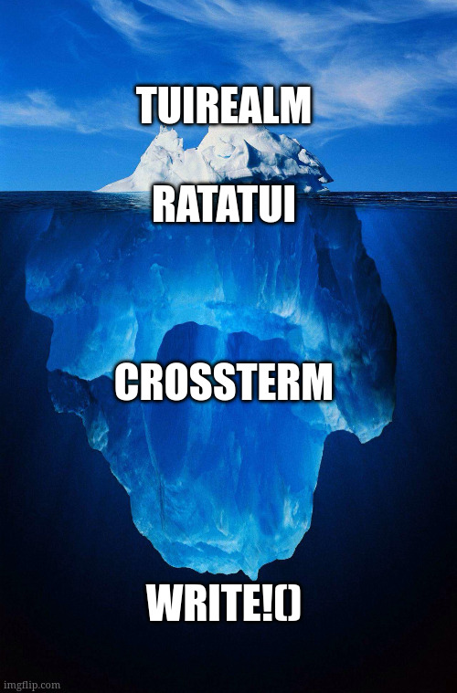
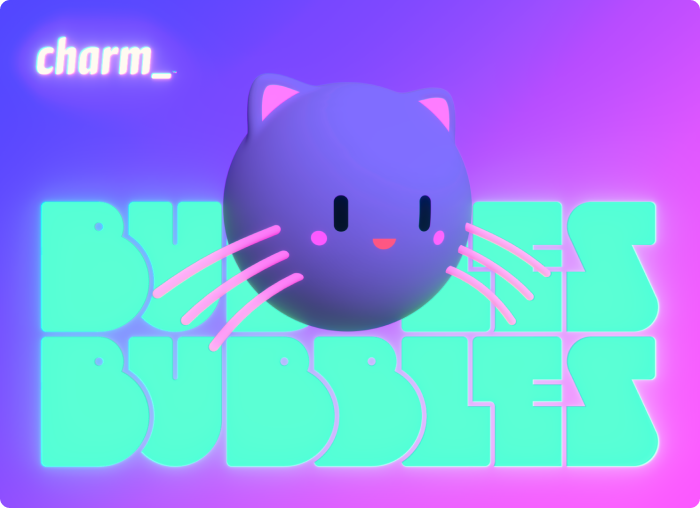

---
theme:
  name: gruvbox-dark
---

<!-- font_size: 3 -->
<!-- alignment: center -->

<!-- jump_to_middle -->

# Popping Boba: Bringing Go's bubbletea to ratatui

<!-- font_size: 2 -->

<!-- column_layout: [2, 4, 1] -->

<!-- column: 1 -->

<!-- alignment: left -->

Tushar Saxena [keogami]
https://github.com/keogami
https://linkedin.com/in/keogami--

<!-- reset_layout -->

<!-- end_slide -->


The Terminal
===



<!-- reset_layout -->

<!-- end_slide -->

<!-- jump_to_middle -->

What can you even do with the terminal
===

<!-- end_slide -->

Claude Code
===

<!-- speaker_note: AI-powered terminal assistant - a TUI that took the dev world by storm -->

<!-- font_size: 2 -->



<!-- end_slide -->

Charm's Crush
===

<!-- speaker_note: Beautiful TUI from the Charm ecosystem - Go's bubbletea in action -->

<!-- font_size: 2 -->


<!-- end_slide -->

Vim / Neovim
===

<!-- speaker_note: The OGs - editors that live in your terminal -->

<!-- font_size: 2 -->



<!-- end_slide -->

Helix
===

<!-- speaker_note: The modern take - written in Rust, btw -->

<!-- font_size: 2 -->



<!-- end_slide -->

ani-cli
===

<!-- speaker_note: Yes, someone made an anime player for the terminal. We live in a wonderful timeline -->

<!-- font_size: 2 -->


<!-- end_slide -->

TUIs are _everywhere_
===

<!-- speaker_note: There are way too many to list - here's a taste -->

<!-- font_size: 2 -->



<!-- end_slide -->

<!-- jump_to_middle -->

How deep does the rabbit hole go?
===

<!-- end_slide -->

The TUI Iceberg
===

<!-- speaker_note: We're going to peel layers of abstraction, like going down an iceberg -->

<!-- font_size: 2 -->



<!-- end_slide -->

<!-- jump_to_middle -->

<!-- font_size: 3 -->

Tip of the Iceberg: TUI Frameworks
===

<!-- end_slide -->

TUI Frameworks
===

<!-- speaker_note: tuirealm and friends - the "React" of terminal UIs -->

<!-- font_size: 2 -->

<!-- column_layout: [1, 5, 1] -->

<!-- column: 1 -->

Crates like **tuirealm** try to give you the full framework experience:

<!-- pause -->

- Event handling, propagation, bubbling
- High-level components out of the box
- No manual bookkeeping for inputs, scrolling, etc

<!-- pause -->


<!-- reset_layout -->

<!-- end_slide -->

TUI Frameworks: tuirealm in Action
===

<!-- speaker_note: Show the Elm-style API - Model, Msg, Update, View -->

<!-- font_size: 2 -->

```rust +line_numbers
struct Model {
    counter: i32,
}

enum Msg {
    IncrementCounter,
}

impl Update<Msg> for Model {
    // ...
}

impl View for Model {
    // ...
}
```

<!-- end_slide -->

TUI Frameworks: Cmd
===

<!-- speaker_note: Cmd abstracts user input into operations your component understands -->

<!-- font_size: 2 -->

```rust +line_numbers
pub enum Cmd {
    Type(char),
    Move(Direction),
    Scroll(Direction),
    GoTo(Position),
    Submit,
    Delete,
    Cancel,
    Toggle,
    Change,
    Tick,
    Custom(&'static str),
    None,
}
```

<!-- end_slide -->

TUI Frameworks: Component
===

<!-- speaker_note: Component::on maps raw Events into your app's Msg type -->

<!-- font_size: 2 -->

```rust +line_numbers
struct MyCounter;

impl Component<Msg, NoUserEvent> for MyCounter {
    fn on(&mut self, ev: Event<NoUserEvent>) -> Option<Msg> {
        match ev {
            Event::Keyboard(KeyEvent {
                code: Key::Char('+'), ..
            }) => {
                self.perform(Cmd::Custom("increment"));
                Some(Msg::IncrementCounter)
            }
            _ => None,
        }
    }
}
```

<!-- end_slide -->

TUI Frameworks: The Update Loop
===

<!-- speaker_note: The update function ties it all together - receive Msg, update Model -->

<!-- font_size: 2 -->

```rust +line_numbers
impl Update<Msg> for Model {
    fn update(&mut self, msg: Option<Msg>) -> Option<Msg> {
        match msg {
            Some(Msg::IncrementCounter) => {
                self.counter += 1;
                None
            }
            _ => None,
        }
    }
}
```

<!-- end_slide -->

TUI Frameworks: Putting It Together
===

<!-- speaker_note: The main loop - init terminal, mount components, poll and redraw -->

<!-- font_size: 2 -->

```rust +line_numbers
fn main() {
    // init terminal
    let mut terminal = CrosstermTerminal::new(stdout());
    terminal.enable_raw_mode().unwrap();
    terminal.enter_alternate_screen().unwrap();

    // mount components
    let mut app = Application::init(EventListenerCfg::default());
    app.mount("counter", Box::new(MyCounter));
    app.active("counter").unwrap();

    // redraw loop
    loop {
        app.view("counter", &mut terminal.frame(), area);
        terminal.draw().unwrap();

        let messages = app.tick(PollStrategy::Once);
        for msg in messages {
            model.update(msg);
        }
    }
}
```

<!-- end_slide -->

TUI Frameworks: The Catch
===

<!-- speaker_note: They're opinionated and immature - not quite production ready -->

<!-- font_size: 2 -->

<!-- column_layout: [1, 5, 1] -->

<!-- column: 1 -->

- _Very_ opinionated
- Also not very well developed, frankly
- Limited ecosystem and documentation
- You're locked into their way of doing things

<!-- pause -->

Let's go deeper...

<!-- reset_layout -->

<!-- end_slide -->

<!-- jump_to_middle -->

<!-- font_size: 3 -->

Going Deeper: Ratatui
===

<!-- end_slide -->

Ratatui
===

<!-- speaker_note: The most popular TUI crate - it's what most Rust TUIs are built on -->

<!-- font_size: 2 -->

<!-- column_layout: [1, 5, 1] -->

<!-- column: 1 -->

The **most popular** TUI crate in Rust

- Agnostic over backends (we will get there)
- Provides you with layout mechanisms
- Widgets, buffers, and a rendering pipeline

<!-- pause -->

But there's a catch...

<!-- reset_layout -->

<!-- end_slide -->

Ratatui: You Do The Work
===

<!-- speaker_note: Ratatui gives you building blocks but you wire everything yourself -->

<!-- font_size: 2 -->

_You_ need to do **all** the bookkeeping

```rust +line_numbers
fn ui(f: &mut Frame, app: &App) {
    let chunks = Layout::default()
        .direction(Direction::Vertical)
        .constraints([
            Constraint::Length(3),
            Constraint::Min(1),
        ])
        .split(f.area());

    let input = Paragraph::new(app.input.as_str())
        .block(Block::default().borders(Borders::ALL).title("Input"));
    f.render_widget(input, chunks[0]);

    // you manage state, focus, events... everything
}
```

<!-- end_slide -->

<!-- jump_to_middle -->

<!-- font_size: 3 -->

Going Deeper: Terminal Wrappers
===

<!-- end_slide -->

Terminal Wrappers
===

<!-- speaker_note: Crossterm and Termion abstract over different terminal implementations -->

<!-- font_size: 2 -->

<!-- column_layout: [1, 5, 1] -->

<!-- column: 1 -->

**Crossterm**, **Termion** — the backends ratatui sits on

Why do they exist?

<!-- pause -->

"Cross-browser shenanigans all over again"

<!-- pause -->

- Different terminals behave differently
- These crates provide a simple abstraction over terminal primitives:
  - Cursor movement
  - Text styling (bold, colors, etc)
  - Alternate screen buffer

<!-- reset_layout -->

<!-- end_slide -->

Terminal Wrappers: Crossterm in Action
===

<!-- speaker_note: Show the basic crossterm setup - raw mode, alternate screen, event loop -->

<!-- font_size: 2 -->

```rust +line_numbers
use crossterm::{
    terminal::{enable_raw_mode, EnterAlternateScreen},
    event::{self, Event, KeyCode},
    execute,
};

fn main() -> std::io::Result<()> {
    enable_raw_mode()?;
    execute!(std::io::stdout(), EnterAlternateScreen)?;

    loop {
        if let Event::Key(key) = event::read()? {
            if key.code == KeyCode::Char('q') { break; }
        }
    }
    Ok(())
}
```

<!-- end_slide -->

Terminal Wrappers: Styling & Cursor
===

<!-- speaker_note: Crossterm gives you cursor movement and styled text output via execute! macro -->

<!-- font_size: 2 -->

```rust +line_numbers
use crossterm::{
    cursor::MoveTo,
    style::{Color, Print, SetForegroundColor, Stylize},
    execute,
};

fn main() -> std::io::Result<()> {
    let mut out = std::io::stdout();

    execute!(
        out,
        MoveTo(5, 10),
        SetForegroundColor(Color::Red),
        Print("Hello, Terminal!".bold()),
        MoveTo(5, 12),
        SetForegroundColor(Color::Green),
        Print("Crossterm makes it easy"),
    )
}
```

<!-- end_slide -->

Terminal Wrappers: The Limitations
===

<!-- speaker_note: They're write-only and miss advanced terminal features -->

<!-- font_size: 2 -->

<!-- column_layout: [1, 5, 1] -->

<!-- column: 1 -->

- Still no OSC queries — it's **write-only**
  - Can't ask the terminal "what size are you _really_?"
  - Can't detect terminal capabilities

<!-- pause -->

- No special OSC commands either
  - No inline images? **bummer**
  - No clipboard access
  - No hyperlinks

<!-- pause -->

Let's go even deeper...

<!-- reset_layout -->

<!-- end_slide -->

<!-- jump_to_middle -->

<!-- font_size: 3 -->

Rock Bottom: std::fmt::write!()
===

<!-- end_slide -->

Good ol' write!()
===

<!-- speaker_note: It comes with Rust - no crates needed, just raw escape sequences -->

<!-- font_size: 2 -->

<!-- column_layout: [1, 5, 1] -->

<!-- column: 1 -->

Comes with Rust. No crates needed.

The terminal is just a stream of bytes. You already know some escape sequences:

```rust
print!("Hello\n");   // newline
print!("Col1\tCol2"); // tab
print!("\x07");        // bell (yes, your terminal can beep)
```

<!-- pause -->

But there's a whole world beyond `\n` and `\t`...

<!-- reset_layout -->

<!-- end_slide -->

Raw Mode
===

<!-- speaker_note: Normally the terminal buffers and processes input - raw mode gives you full control -->

<!-- font_size: 2 -->

<!-- column_layout: [1, 5, 1] -->

<!-- column: 1 -->

Normally your terminal is in **cooked mode**:

- Input is line-buffered (waits for Enter)
- Special keys are interpreted (Ctrl+C = SIGINT)
- Echo is on (you see what you type)

<!-- pause -->

**Raw mode** turns all of that off:

- Every keypress is delivered immediately
- No signal generation
- No echo
- _You_ are in full control

<!-- pause -->

This is how TUIs actually work under the hood.

<!-- reset_layout -->

<!-- end_slide -->

Advanced Escape Sequences
===

<!-- speaker_note: ANSI escape codes are the real magic - CSI sequences control everything -->

<!-- font_size: 2 -->

```rust +line_numbers
use std::io::Write;

fn main() {
    let mut out = std::io::stdout();

    // Clear the entire screen
    write!(out, "\x1B[2J").unwrap();

    // Move cursor to row 5, column 10
    write!(out, "\x1B[5;10H").unwrap();

    // Bold + Red text
    write!(out, "\x1B[1;31mHello, Terminal!\x1B[0m").unwrap();

    // Enable Kitty keyboard protocol
    write!(out, "\x1B[>1u").unwrap();

    out.flush().unwrap();
}
```

<!-- pause -->

This is what **every** TUI library does under the hood.

<!-- end_slide -->

Anatomy of Escape Sequences
===

<!-- speaker_note: Break down the structure so the audience can read any sequence they encounter -->

<!-- font_size: 2 -->

<!-- column_layout: [1, 5, 1] -->

<!-- column: 1 -->

**CSI — Control Sequence Introducer**

- Structure: `ESC [ <params> <final byte>`
- `\x1B[` is the introducer
- `<params>` are `;`-separated numbers
- `<final byte>` is the command letter
- Example: `\x1B[5;10H` → ESC + `[` + row `5` + `;` + col `10` + `H` (cursor position)

<!-- pause -->

**OSC — Operating System Command**

- Structure: `ESC ] <code> ; <data> BEL`
- `\x1B]` is the introducer
- `<code>` identifies the command
- `<data>` is the payload
- Terminated by `\x07` (BEL) or `\x1B\\` (ST)
- Example: `\x1B]8;;URL\x07` → ESC + `]` + code `8` + `;;` + URL + BEL

<!-- pause -->

Full list: `man console_codes` or https://invisible-island.net/xterm/ctlseqs/ctlseqs.html

<!-- reset_layout -->

<!-- end_slide -->

What Else Can Escape Sequences Do?
===

<!-- speaker_note: This is where it gets wild - terminals can do way more than most people realize -->

<!-- font_size: 2 -->

<!-- column_layout: [1, 5, 1] -->

<!-- column: 1 -->

**CSI — Control Sequence Introducer** (`\x1B[...`)

- `\x1B[?1049h` — Switch to **alternate screen buffer**
- `\x1B[5;15r` — Set a **scroll region** (only rows 5–15 scroll)
- `\x1B[6n` — **Query cursor position** (terminal replies back!)
- `\x1B[>1u` — Enable **Kitty keyboard protocol**

<!-- pause -->

**OSC — Operating System Command** (`\x1B]...`)

- `\x1B]8;;URL\x07` — Clickable **hyperlinks**
- `\x1B]52;c;BASE64\x07` — Read/write the **system clipboard**
- `\x1B]1337;File=inline=1:BASE64\x07` — **Inline images** (iTerm2 protocol)
- `\x1B_Gf=100,a=T;BASE64\x1B\\` — **Inline images** (Kitty graphics protocol)
- `\x1B]11;?\x07` — Query **background color** (light/dark detection)

<!-- reset_layout -->

<!-- end_slide -->

<!-- jump_to_middle -->

<!-- font_size: 3 -->

So... Why Are We Here?
===

<!-- end_slide -->

PoppingBoba
===

<!-- speaker_note: Introduce PoppingBoba as a Rust implementation of bubbletea's architecture on top of ratatui -->

<!-- font_size: 2 -->

<!-- column_layout: [1, 5, 1] -->

<!-- column: 1 -->

<!-- alignment: center -->

A Rust implementation of Go's **bubbletea** — for **ratatui**



<!-- reset_layout -->

<!-- end_slide -->

<!-- jump_to_middle -->

Fin.
===

<!-- end_slide -->

<!-- font_size: 2 -->

Mentorship
===

<!-- speaker_note: Shill the mentorship program -->

<!-- new_lines: 3 -->

<!-- column_layout: [1, 3, 1] -->

<!-- column: 1 -->

<!-- alignment: center -->

Interested in learning Rust with guidance?

<!-- font_size: 3 -->

**https://mentorship.keogami.dev**

<!-- font_size: 2 -->

<!-- new_lines: 3 -->

**Tushar Saxena [keogami]**

https://github.com/keogami

https://linkedin.com/in/keogami--

<!-- reset_layout -->
